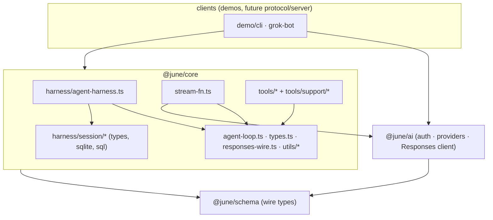
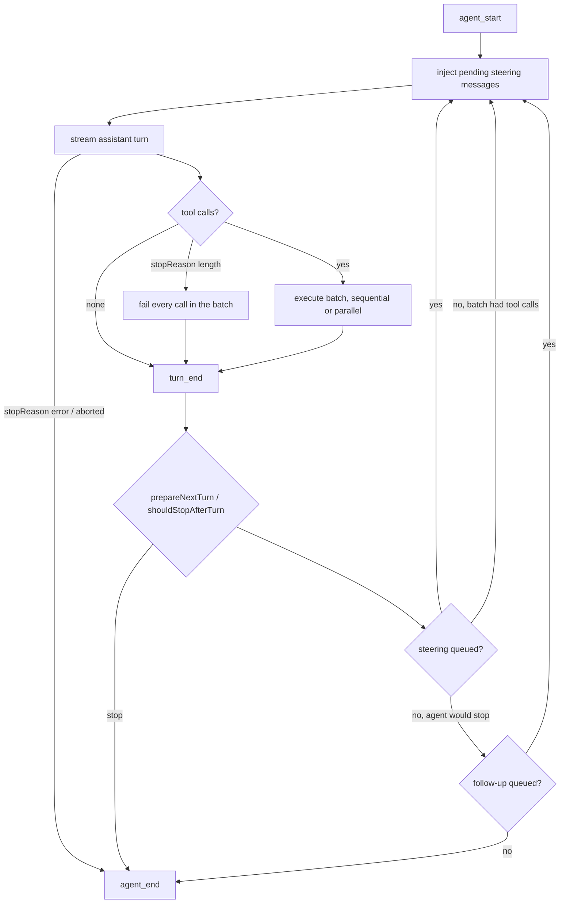
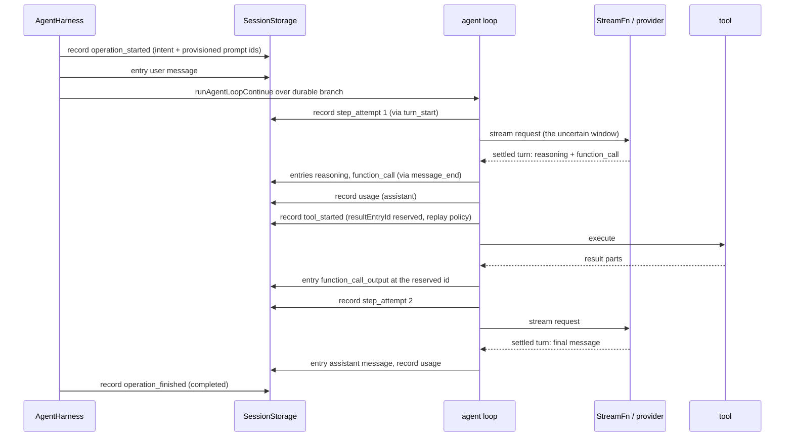
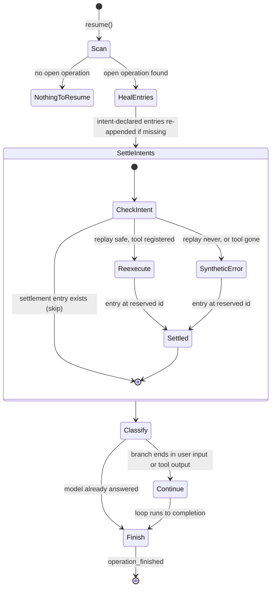

# June core: design and implementation record

Status: document of record for `@june/core`, the `@june/schema` wire it stores, and the `@june/ai` boundary it streams through. `blueprint.md` remains the brainstorm and decision journal; when the two disagree on a contract, this document wins and blueprint gets a correction entry. This file is living and appendable. Add sections; do not rewrite history silently.

Register: **must** and **must not** are normative. "Landed" marks facts verified in the working tree on 2026-08-18. File and line references are to that snapshot and may drift; the contract statements do not.

Upstream reference: pi (`earendil-works/pi`), primarily `@earendil-works/pi-agent-core` 0.84.2 and the AgentHarness implementation specification (`packages/agent/docs/harness.md`, "the pi spec" below). Ported files carry a `Based on <link>` credit header.

Demos (`packages/demo/*`) are frozen. They are consumers, not drivers. No core contract may change to satisfy a demo, and demo breakage does not block core work.

---

# Part 0: Orientation

## 0.1 What June core is

`@june/core` is a durable runtime for agent conversations, built as composable blocks: a standalone agent loop, a harness that composes durability over it, a session storage contract with a SQLite backend, and a coding tool set. Clients never import it; they speak `@june/schema` and (later) `@june/protocol`. The core is opinionated the way VSCode is: a small set of load-bearing extension seams with exactly one obvious way to use each, not a plugin socket on every wall.

Three ideas organize everything below:

1. **The agent loop is a solved problem.** pi solved it. June ports it and tracks upstream. Part 1 states the adoption policy.
2. **The harness and the wire are where June thinks for itself.** The session model (Part 3) and the wire schema (Part 2) are owned designs with owned rationale.
3. **A seam earns its keep with two real implementations or one named concrete consumer.** Part 4 applies this test to every injection point and kills the ones that fail it.

## 0.2 System model

### A session is a tree plus a ledger

A session is four things, ordered by one per-session `seq` counter (`harness/session/types.ts:243`):

- **Entry tree.** Write-once entries (`Entry`, `types.ts:125`): messages, model changes, thinking-level changes, custom entries. Each entry names its parent; branches share prefixes. An entry is never mutated or deleted.
- **Records ledger.** Append-only orchestration records (`LaneRecord`, `types.ts:202`): `operation_started`, `operation_finished`, `step_attempt`, `tool_started`, `queue_enqueued`, `queue_cancelled`, `abort_requested`, `usage`. Records are the durable memory of what the harness was doing; entries are the durable memory of what was said.
- **Lane pointers.** Named mutable cursors into the tree. Every session has `main`; today `main` is the only lane (`agent-harness.ts:41`). A lane owns its leaf and at most one open operation.
- **Facts.** Mutable named values (today: the session name).

Entries and records are write-once. Lane pointers and facts are the only mutable state. One `seq` orders all four, which is what makes `getLog({afterSeq})` a coherent replay cursor for any client.

### The loop is a pure function over context

`runAgentLoop` (`agent-loop.ts:99`) takes messages, tools, a config of hooks, an event sink, a signal, and a `StreamFn`. It owns turn sequencing, tool batch execution (sequential or parallel), steering and follow-up drains, and the length-stop rule (a turn cut off by the token limit fails its whole tool batch rather than executing possibly truncated arguments, `agent-loop.ts:219`). It imports nothing from the harness, sessions, or providers. That is the locked one-way rule from blueprint (Decision 2026-08-12): harness → loop, never loop → harness.

### A tool result is parts, always

`AgentToolResult.content` is `ToolResultPart[]` (`@june/schema`), a discriminated union of text and image parts. There is no `string | parts` union to sniff. Sessions store parts verbatim in `function_call_output.output`; the provider adapter in `@june/ai` encodes them into its API's shape at request time. Adapters encode; sessions never store pre-encoded provider payloads. `toolResultText` flattens to text for display.

### An operation is an effect sandwich

Every uncertain effect is bracketed by durable commits. A run commits `operation_started` before the loop turns, `step_attempt` before each provider request, and a `tool_started` intent (carrying a provisioned `resultEntryId` and a `replay: "never" | "safe"` policy) before each tool executes (`agent-harness.ts:467`). The settlement is the `function_call_output` entry appended at that provisioned id. After a crash, an intent whose settlement entry does not exist is exactly the set of effects whose outcome is unknown. `resume()` settles them by policy: `safe` tools re-execute; `never` tools get a synthetic error entry telling the model to re-issue the call (`agent-harness.ts:261`). Nothing that settled ever replays.

## 0.3 The core design test

From `CLAUDE.md`, restated because every scoping argument comes back to it. Do not ask "can a client render this yet?" Ask: **does the agent loop or the conversation need it?**

- Any modality that can legitimately appear in a conversation must be carriable by the wire and the loop. If the wire cannot carry it, no extension can add it.
- Heavy or policy-laden work on a modality (image resizing, native deps) is injectable, never a core dependency.
- Presentation is the client's problem. A client that cannot render a modality ignores it.

Worked precedent (2026-08-14): image support in `read`. Detection by magic bytes is core (`tools/support/image.ts`). Resizing is an injectable `ImageProcessor` (`tools/read.ts:41`). Rendering is the client's.

## 0.4 Non-goals

- **Exactly-once external effects.** The sandwich gives at-most-once for `never` tools and at-least-once for `safe` tools. Nothing stronger.
- **Multiple writers per session.** One process owns a session; the SQLite lease enforces it (Part 3). Lanes are the answer to workloads that look multi-writer.
- **Provider stream resumption.** A partial stream is process-local. Only settled turns persist.
- **Rebuilding pi.** Where pi has already answered a loop question, June adopts the answer (Part 1).
- **Product chrome in core.** Approval cards, permission modals, plan mode, MCP marketplaces: composition or client territory, per blueprint's core-vs-UI litmus.

---

# Part 1: The agent loop is a solved problem

## 1.1 Adoption, not invention

June's loop, tools, and harness skeleton are ports of pi, and that is the policy, not an embarrassment. pi's loop encodes years of fixes June must not rediscover: the length-stop batch failure, ordered delta emission under async sinks, blocked-tool termination, parallel batches that preserve result order, abort checks between every phase. The blueprint's "handwritten" rule means June owns the code in this repo and composes its own product; it does not mean rewriting solved logic for the sake of authorship.

**Corollary, from the user's directive (2026-08-18): invented "normalizing functions" with no pi counterpart are wasted energy and must stop.** Where June found itself writing shape-sniffing helpers pi does not need (`isAssistantMessage`, the guards in `getToolCalls`), the correct response is not a better helper; it is fixing the type that made the helper necessary (Part 2). A helper that exists to compensate for a too-loose type is a symptom, and symptoms do not get polished.

## 1.2 Which files track upstream

Every ported file must carry a `Based on <url>` header naming its pi source. A file that materially tracks upstream should also carry a `Synced with pi <commit or version>` line; today only `agent-loop.ts:6` does (commit `b1efcf7`), and the others must gain one at their next reconciliation.

| June file | pi source (0.84.2) | class |
|---|---|---|
| `src/agent-loop.ts` | `src/agent-loop.ts` | tracked port |
| `src/types.ts` | `src/types.ts` | tracked port, wire-substituted |
| `src/utils/event-stream.ts` | pi `EventStream` (pi-ai) | tracked port |
| `src/harness/agent-harness.ts` | `src/harness/agent-harness.ts` + the pi spec | tracked port, scoped |
| `src/harness/result.ts` | `src/harness/result.ts` | tracked port |
| `src/harness/session/types.ts` | the pi spec (ported before upstream code existed) | tracked port of the spec |
| `src/harness/session/sqlite.ts` | `packages/session-backends/sqlite-node` + spec Part 1 | owned divergence (Part 3) |
| `src/tools/read,bash,edit,edit-diff,write` | `src/harness/tools/*` | tracked ports |
| `src/tools/grep,find,ls` | pi-coding-agent `core/tools/*` | tracked ports (agent-core 0.84.2 still has no grep/find/ls; coding-agent remains the sanctioned fallback source) |
| `src/tools/support/*` | pi tool support modules | tracked ports |

June-original files, kept deliberately small:

- `src/responses-wire.ts` (37 lines). The loop's wire boundary. Exists only because of the open-struct wire type; Part 2 shrinks it.
- `src/stream-fn.ts` (63 lines). Binds `@june/ai`'s streamed Responses client to the loop's `StreamFn` contract. Its one genuine job is the never-throw guarantee (failures become `stopReason: "error" | "aborted"`, never rejections).
- `src/utils/tool-result.ts` (13 lines). `toolResultContent` / `toolResultText` part helpers.

## 1.3 What "synced with pi \<version\>" means

A sync line asserts: this file was diffed against that upstream point, upstream changes were adopted or explicitly declined, and the only remaining differences fall in the allowed classes of §1.4. Re-syncing is a diff against the published upstream at a named version, not a vibe check. The recovered 0.84.2 sources (from npm source maps) are legitimate diff material when upstream git is unreachable.

## 1.4 What June may change in a ported file

As little as possible. The verified normalized diff of `agent-loop.ts` against pi 0.84.2 shows exactly the allowed classes, and nothing else may join them:

1. **Wire substitution.** pi's `AssistantMessage`/`Message` become June's `ResponseItem`/`AssistantTurn`; the conversion helpers live in `responses-wire.ts`, not inline. Mechanical, boundary-contained.
2. **No process-global StreamFn registry.** pi 0.84.2 has `setDefaultStreamFn`/`getDefaultStreamFn` (module-global mutable state); June deleted it and every composition passes its `StreamFn` explicitly. This is a deliberate, permanent divergence: an implicit global default is exactly the hidden state the blocks posture forbids.
3. **Rejection containment.** June's `agentLoop`/`agentLoopContinue` route loop rejections into `stream.fail(...)` where pi only handles resolution. Keeps the never-throw discipline airtight at one more boundary. Divergence noted, kept.

Everything else in a ported file must match upstream modulo formatting. New behavior goes in composition files (harness, stream-fn, tools options), never spliced into a ported file. If upstream later fixes something June also fixed, the re-sync adopts upstream's version.

---

# Part 2: The wire (`@june/schema`)

## 2.1 The root cause

`ResponseItem` (`packages/schema/src/index.ts`) is one open struct: every field optional, plus an index signature. The type cannot say "a function_call always has `call_id`, `name`, `arguments`", so every consumer re-proves it at runtime:

- `responses-wire.ts:9` answers "is this assistant output?" by sniffing `type === "message" || "reasoning" || "function_call"`.
- `responses-wire.ts:24` filters on `call_id === undefined` and papers over the type with `?? ""` and `?? "{}"` defaults.
- `agent-harness.ts:322` re-sniffs `lastMessage.role === "user" || lastMessage.type === "function_call_output"` to decide resumability.
- The grok-bot renderer carries a TODO begging for discriminated parts (`conversation.tsx:242`).

pi does not have this problem because pi does not hand-roll wire types at all: pi-ai leans on the official provider SDK types and hand-rolls only its own provider-neutral domain model, which is a proper discriminated union. June chose wire-shaped storage (Responses items as the v0 session wire); that choice is fine, but it obliges June to type the wire it stores.

## 2.2 The specification

`ResponseItem` must become a discriminated union on `type`. Target shape:

```ts
export type ResponseItem =
  | { type: "message"; role: "user" | "system" | "developer" | "assistant";
      content: string | ContentPart[] }
  | { type: "reasoning"; content?: ContentPart[]; summary?: ContentPart[];
      encrypted_content?: string }
  | { type: "function_call"; call_id: string; name: string; arguments: string }
  | { type: "function_call_output"; call_id: string; output: ToolResultPart[] };
```

Rules:

1. **Every stored item carries `type`.** Bare `{role, content}` user input is normalized to `type: "message"` by one parse function at the boundary where untyped data enters (harness `normalize`, provider response decoding). Internal code never sees an untyped item.
2. **The index signature dies.** Unknown provider fields do not ride along in session storage. A provider field June must round-trip gets a named optional field on its variant (as `encrypted_content` already does). If a provider needs more, the union grows a field, visibly, in one file.
3. **`function_call_output.output` is `ToolResultPart[]`, not `string | ToolResultPart[]`.** The parse function converts legacy bare strings to a single text part on read. Adapters encode parts at request time; nothing stores an encoded string.
4. **Exhaustive matching is mandatory.** Consumers switch on `type` with a `never` default. A new variant becomes a compile error at every consumer, which is the point.

## 2.3 What dies as a result

- `isAssistantMessage`'s type-sniff body. Assistant authorship becomes a one-line check over the union (`reasoning`, `function_call`, or `message` with `role: "assistant"`).
- The `call_id === undefined` filter and both `??` defaults in `getToolCalls`. A `function_call` item proves its own fields.
- The `agent-harness.ts:322` shape re-sniff, which becomes a typed match.
- The grok-bot TODO, and every future client's private re-derivation of the same facts.
- Most of `responses-wire.ts`. What remains is honest conversion (`toToolDefinition`, argument decoding), not compensation.

`@june/ai`'s `encodeToolResultOutput`/`encodeInputItem` (`api/responses.ts`) are not in this kill list. They are the adapter doing its stated job, encoding stored parts into a specific API's shape at request time. The ban is on normalizers that compensate for June's own types, not on adapters that translate at a real boundary.

## 2.4 Type ownership (landed)

`@june/schema` now owns the scalar vocabulary shared by core and ai: `ThinkingLevel`, `StopReason`, `StreamDelta`, `TurnUsage`, `ToolResultPart` and friends. `core/src/types.ts` and `@june/ai` import them (`types.ts:9`, `ai/src/api/responses.ts:1`, `ai/src/provider.ts:1`); `ReasoningEffort` is derived as `Exclude<ThinkingLevel, "off">` rather than restated. The previous state (four structurally identical type families defined twice, reconciled by hand in `stream-fn.ts`) is the canonical example of what duplicate vocabulary costs, and must not recur: **a shared shape is defined once, in schema, and derived elsewhere.**

---

# Part 3: The harness and session model

## 3.1 What is pi's and what is June's

The durability *model* is pi's spec, adopted whole: write-once entries and records over mutable lane pointers, one `seq`, the effect sandwich, replay policy, crash resume from the durable branch. June ported it from the spec before upstream had shipped harness code, and June tracks the spec as the contract. Where the spec and shipped pi code disagree, the spec wins.

One such disagreement exists today and matters. The current pi spec (Part 0 §0.3, Part 3) has moved to a **total operation-state register** model: recovery reads one `op.state/{operationId}` register holding the complete program counter and switches on it, and the terminal transaction deletes the operation's registers. Shipped pi 0.84.2 code, and June's port, still use the earlier **append-only records ledger** model, where recovery infers position from which records lack settlements. Both implement the same sandwich; the register model has strictly better recovery properties (point lookups, no history folding, no dead state accumulating in finished sessions). Position: June's records ledger is the current, correct realization of the spec's earlier revision; migrating to total `op.state` registers is a named future schema-evolution step, taken when June next reconciles the harness against upstream's landed implementation, not improvised piecemeal. Open question 1 records it.

## 3.2 The run lifecycle (as built)

`AgentHarness` (`harness/agent-harness.ts`) is the only composition over the loop. One lane, run operations only.

- **Accept.** `prompt()` drains the `nextRun` queue, commits `operation_started` carrying the original prompt and the provisioned initial message entries, then appends those entries (`agent-harness.ts:187`). A second `prompt` while a run is active gets `LaneBusy`; the queues are the correct path (`steer`, `followUp`, `nextRun`).
- **Drive.** The harness drives `runAgentLoopContinue` through the loop's hook surface, never a fork of the loop: `turn_start` commits `step_attempt`, `beforeToolCall` commits the `tool_started` intent, `message_end` appends the entry at its provisioned id, usage events append `usage` records (`agent-harness.ts:453`).
- **Queues are records.** `steer`/`followUp`/`nextRun` commit `queue_enqueued` with a provisioned target entry; a queue item is consumed exactly when its target entry exists, cancelled exactly when a `queue_cancelled` record names it (`agent-harness.ts:366`). Queued input therefore survives crashes.
- **Finish.** Every outcome path, including harness-internal throw, commits `operation_finished` (`agent-harness.ts:564`). Errors are result-typed (`Result`, `TaggedError`: `LaneBusy`, `NoActiveRun`, `NothingToResume`, `Closed`), never thrown across the public surface.
- **Resume.** `create()` reports operations left open by a crash; `resume()` re-appends missing intent-declared entries, settles unsettled tool intents by replay policy, then either continues the loop (durable branch ends in user input or tool output) or closes the operation as completed (`agent-harness.ts:261`).

Deferred scope, recorded so nobody mistakes absence for a decision: additional lanes, compaction, branch navigation and forks, skills and prompt templates, deferred tool settlement and wake (the cross-agent gap in blueprint), manual action stepping. All compose onto the same log without schema changes; that was the point of adopting the model whole.

## 3.3 Owned divergences in the SQLite backend

`harness/session/sqlite.ts` diverges from the pi spec in three deliberate ways. These are June decisions with rationale, not drift.

1. **One database file holds every session**, keyed by `session_id`, where the spec's S2 slice prescribes one file per session. Rationale: June's first product surface wants cross-session listing and cross-session search as cheap queries, and a desktop host managing thousands of per-session files earns nothing for the added lifecycle code. Cost accepted: a corrupt database risks every session, and per-session `VACUUM INTO` forks are harder. Revisit if either cost materializes.
2. **The writer lease is fenced and heartbeat-renewed** (`sqlite.ts:38`, comment block). The spec requires a fenced lease; June's implementation adds transactional renewal on every write plus an idle heartbeat, keyed on `(owner, fence)`, so a stale owner can neither write past its successor nor release the successor's lease, and an expired lease genuinely means a dead owner. WAL would happily interleave writers from several processes; the lease is what makes one-writer-per-session an enforced property rather than a convention.
3. **FTS5 search is built into the backend** rather than the spec's standalone `SessionSearchService` with durable cursors. The single-file decision makes one FTS index across sessions nearly free (external-content index over `entries`). When June grows a second backend, search must be re-cut along the spec's service boundary; until then a service abstraction would have a population of one (Part 4 rule).

Two implementation notes that are load-bearing and must survive any rewrite: every writing transaction opens `BEGIN IMMEDIATE` (a deferred read-then-upgrade can hold a stale snapshot that `busy_timeout` cannot refresh), and payloads are stored as JSON blobs while queried columns (`type`, `lane`, `run_id`, `seq`) are denormalized for indexes.

## 3.4 Session contract invariants

The comment at `session/types.ts:238` is normative and repeated here: entries and records are write-once; lane pointers and facts are the only mutable state; one `seq` per session orders all four kinds. A backend must not give each table its own counter; doing so breaks `getLog` and every `afterSeq` cursor. `findOpenOperations` returns newest first, and more than one open operation on a lane is corruption, not a case to handle gracefully.

`toJsonValue` (`types.ts:27`) guards the durable boundary: a value is committed only if live execution and JSON replay are equivalent (finite numbers, no `-0`, plain objects and arrays, no shared or circular references, no getters). This is the parse-at-the-boundary discipline pointed inward, and tool arguments cross it before they are ever durable (`agent-harness.ts:478`).

---

# Part 4: Extension seams

## 4.1 The rule

**An abstraction earns its keep with at least two real implementations or one named concrete consumer.** "Someone might want to intercept this" is not a consumer. A seam that fails the test is deleted, and the direct call inlined, until a real second implementation shows up. This is the VSCode posture: few seams, each load-bearing, each with an obvious default.

## 4.2 Load-bearing seams (keep)

| Seam | Contract | Why it passes |
|---|---|---|
| `StreamFn` | `(LlmContext, StreamFnOptions) => Promise<AssistantTurn>`; must never throw; failures are `stopReason` values (`types.ts:54`) | The provider boundary itself. Two real implementations exist today (`createProviderStreamFn` over `@june/ai`, test doubles in `agent-loop.test.ts`), and it is the loop's independence from providers made concrete. Always passed explicitly; no default registry (§1.4). |
| `SessionStorage` / `SessionRepo` / `SessionSearch` | `session/types.ts:243` | The storage boundary. SQLite ships; the pi spec names Memory and JSONL siblings, blueprint names Durable Objects; the conformance-suite pattern from the spec is the planned second consumer. |
| `ImageProcessor` | `read.ts:41`; async, receives bytes and mime, returns possibly converted bytes | The injectable-heavy-modality precedent from §0.3. Named consumers: hosts with sharp/native codecs; core stays dependency-free. |
| Tool factories | `createAllTools(cwd, options)` plus per-tool `create*Tool` (`tools/index.ts`) | The composition surface for hosts choosing tool sets. Pruned to the factories with actual callers (landed; the speculative `createTool`/`createCodingTools`/`createReadOnlyTools`/`allToolNames` are gone). |
| `HarnessListener` / `AgentEvent` | `subscribe()` on the harness; the loop's event vocabulary (`types.ts:196`) | The client rendering surface. Every UI attaches here; the protocol layer will fan it out. |
| `HarnessTool.replay` | `"never" \| "safe"` per tool (`agent-harness.ts:77`) | Small, but it is the entire crash-recovery policy surface for tools. |

## 4.3 The effects boundary (direction), and what it kills

The four per-tool seams `BashOperations` (`tools/bash.ts:84`), `GrepOperations` (`tools/grep.ts:77`), `FindOperations` (`tools/find.ts:70`), and `LsOperations` (`tools/ls.ts:37`) each have exactly one implementation and no named second consumer. Four bespoke interfaces are the wrong shape for the real requirement, which blueprint already names: **tool host placement**. The thing a host actually swaps is "where filesystem and shell effects execute" (this machine, a VM, a container), and pi 0.84.2 models it as one interface:

```ts
// pi-agent-core 0.84.2, harness/types.ts:315
export interface ExecutionEnv extends FileSystem, Shell {}
// harness/tools/tool-context.ts
export interface ExecutionToolContext { env: ExecutionEnv }
```

Specification: June adopts an `ExecutionEnv`-shaped effects boundary. One interface in core covering the file and shell operations the built-in tools need; tools receive it as context; `createAllTools` wires the local Node implementation by default. The four `*Operations` interfaces are then deleted, per the migrate-callers-then-delete rule, in one wave. The remote tool host (blueprint's local-vs-cloud placement table) is the named second implementation this seam is built for; until it lands, the local implementation plus the pi contract keep the seam honest.

Interim status: `bash.ts`'s header already documents `BashOperations` as a stand-in for `env.executeShell`. That stand-in must not gain siblings or features; it dies with the wave.

## 4.4 Seams that stay closed

- No hook to replace the loop's turn sequencing. Compose around the loop or fork the project.
- No pluggable id scheme, seq scheme, or entry base shape. The storage contract is the contract.
- No logger injection (`blueprint` observability decision): the event stream is the product log; process diagnostics get a telemetry context later, OTel-shaped.
- No second session model, ever (the prior-host cautionary tale in blueprint). One harness instance owns a session.

---

# Part 5: Invariants

Storage and session:

1. Entries and records are write-once. Writing under an existing id is corruption.
2. One `seq` per session orders entries, records, lane moves, and facts. Backends must not shard counters.
3. Lane pointers and facts are the only mutable state.
4. An entry's parent chain never changes; a lane's leaf moves only by append (navigation later).
5. At most one operation is open per lane. `findOpenOperations` returning two is corruption, not load.
6. A value crosses into durable storage only through `toJsonValue` equivalence checking.

Effect sandwich:

7. The `tool_started` intent, with its provisioned `resultEntryId` and replay policy, must commit before the tool executes.
8. A settlement entry is written exactly once, at its provisioned id. Recovery must not mint a new id for a settled or synthetic result.
9. Recovery never re-executes a settled effect. Unsettled `safe` intents re-execute with persisted arguments; unsettled `never` intents settle as synthetic errors that instruct the model to re-issue.
10. Every accepted operation eventually commits `operation_finished`, including on harness-internal failure.

Loop and boundaries:

11. The loop must not import harness, session, provider, or Node-host modules. The harness reaches the loop only through its public hook surface.
12. A `StreamFn` must not throw or reject; all failure is in-band `stopReason`.
13. A turn with `stopReason: "length"` fails its entire tool batch; no possibly-truncated call executes.
14. Tool results are `ToolResultPart[]` end to end; adapters encode at request time; sessions store parts verbatim.
15. Queue items are durable records; consumption is the existence of the target entry, cancellation is a `queue_cancelled` record. In-memory queue state is never authoritative.
16. Public harness surfaces return `Result`; tagged errors (`LaneBusy`, `NoActiveRun`, `NothingToResume`, `Closed`) are values, not throws.

Policy:

17. Ported files change only within §1.4's three classes. New behavior composes; it does not splice.
18. Shared type vocabulary is defined once in `@june/schema` and derived elsewhere.
19. Every seam in Part 4 keeps its two-implementations-or-named-consumer justification current; a seam that loses it gets deleted, not grandfathered.

---

# Part 6: Build order

Sequenced so each slice ends in a check, and subtraction precedes construction. Slices 1 and 2 are the cleanup work order (Part 7 is the itemized ledger); nothing new builds on the old base.

| # | Slice | Implement | Acceptance |
|---|---|---|---|
| 1 | **Subtract** | Finish the cleanup ledger's open deletions: react out of `@june/ai`'s runtime deps, remaining dead exports. | `pnpm check` clean; ledger's open rows closed or re-justified. |
| 2 | **Wire union** | The Part 2 `ResponseItem` union in `@june/schema`, the boundary parse function, migration of every consumer (`responses-wire.ts` shrinks, `agent-harness.ts:322` sniff becomes a typed match, adapters unchanged in role). | Compile-time exhaustiveness at every `type` switch; loop conformance tests green; a legacy bare-string `output` parses to parts. |
| 3 | **Effects boundary** | `ExecutionEnv` in core, local Node implementation, tools take context, delete all four `*Operations` seams in the same wave. | Tool behavior tests (slice 4 can land first if sequencing demands); no `*Operations` symbol remains. |
| 4 | **Tool test debt** | Focused tests for bash, edit, edit-diff (527 lines of fuzzy matching with zero tests), grep, find, read, write, truncate (278 lines of byte math), and the support modules. Port pi's cases where they exist. | Every tool file has behavior tests; edit-diff and truncate get edge-case suites. |
| 5 | **Session conformance suite** | Backend-agnostic conformance tests in the spirit of the pi spec's testing slice, run against SQLite; Memory backend as the second implementation that keeps the contract honest. | Both backends pass one suite; the suite covers crash positions from §3.2. |
| 6 | **Reconcile with upstream harness** | Diff harness, session types, and tools against pi's landed implementation at a named version; decide the records-ledger → `op.state` register migration (open question 1) as a schema-evolution step with a migration, or a recorded decline. | Sync lines updated on every tracked file; decision recorded here. |
| 7 | **Lanes, then the deferred list** | Additional lanes first (the model already carries `lane` everywhere), then compaction, forks, skills, deferred settlement and wake, in blueprint's cross-agent-invariants order. | Each lands with its crash drills, per the effect-sandwich invariants. |

---

# Part 7: Cleanup ledger

Snapshot 2026-08-18. "Landed" rows were verified in the working tree this session; they are recorded so the ledger doubles as the audit trail. Line references are to the snapshot.

## Landed

| Item | Where | Disposition |
|---|---|---|
| Dead module `tool-result-images.ts` (88 lines, `normalizeToolResultImages` had zero call sites) | `core/src/tools/support/` | Deleted; export removed from `tools/index.ts`; `read.ts` now owns its `ReadImageProcessor` types (`read.ts:36`) |
| Dead path helpers `formatPathRelativeToCwdOrAbsolute`, `getCwdRelativePath`, `expandPath`, sync `resolveReadPath` (line-for-line duplicate of the async version) | `tools/support/path-utils.ts` | Deleted; `resolveReadPathAsync` remains (`path-utils.ts:119`) |
| Speculative factories `createTool`, `createCodingTools`, `createReadOnlyTools`, `allToolNames` (zero consumers) | `tools/index.ts` | Deleted; `createAllTools` is the surface |
| No-op stubs `trackDetachedChildPid` / `untrackDetachedChildPid` | `tools/support/shell.ts` | Deleted |
| Duplicate type families: `StreamDelta`≡`ResponsesDelta`, `TurnUsage`≡ inline usage, `ThinkingLevel`≡`ReasoningEffort`+"off", `StopReason`⊃`"stop"\|"length"` defined in both core and ai | `core/src/types.ts` vs `ai/src/{api/responses,provider}.ts` | Merged into `@june/schema`; core and ai derive (`core/types.ts:9`, `ai/provider.ts:8`) |

## Open

| Item | Where | Required disposition |
|---|---|---|
| `react` + `react-dom` as **runtime** deps of `@june/ai`, solely for `renderToStaticMarkup` of the OAuth callback page | `ai/package.json:14`, `ai/src/auth/oauth/callback-page.ts` | Replace with a static HTML template string; drop both deps and their `@types` |
| `ResponseItem` open struct and everything it forces | `schema/src/index.ts`; consumers per §2.1 | Part 2 slice 2 |
| Four `*Operations` seams, population of one each | `bash.ts:84`, `grep.ts:77`, `find.ts:70`, `ls.ts:37` | Part 4 §4.3, slice 3, deleted in one wave |
| Zero tests for bash, edit, edit-diff, grep, find, read, write, truncate, and support modules (`tools.test.ts` covers two ls cases) | `core/test/` | Slice 4 |
| Records ledger vs spec's `op.state` registers | `harness/session/types.ts` model | Open question 1; decide at slice 6 |
| Demos: stopped | `packages/demo/*` | Frozen. No development, no core changes on their behalf. Unfreezing is a product decision recorded in blueprint, not a drive-by. |

---

# Part 8: File inventory

Every file in `packages/core/src`, plus the `@june/schema` wire and the `@june/ai` files core touches. Snapshot is post-cleanup and verified: schema, ai, core, demo-cli, and grok-bot typecheck; 23 of 23 core tests pass. Each entry answers three questions in order. What it makes. What it exports. Why it exists as a separate file.

## 8.1 Dependency shape



Two arrows are laws, not habits. The harness depends on the loop and the loop must never depend back (Part 5, invariant 11); and only `stream-fn.ts` may import `@june/ai`, so deleting it leaves the loop, harness, session, and tools compiling untouched. `tools --> loop` means the tools import only the `AgentTool` contract from `types.ts`, not loop internals.

## 8.2 `@june/schema`

`src/index.ts` (~75 lines). The wire vocabulary everything else derives from: `ResponseItem` (the open struct Part 2 replaces), `ContentPart`, `ToolResultTextPart` / `ToolResultImagePart` / `ToolResultPart`, `ToolDefinition`, and the shared scalars `ThinkingLevel`, `StopReason`, `StreamDelta`, `TurnUsage`. Exists so core, ai, and every future client can share one type source with zero runtime code; the package has no dependencies and no functions.

## 8.3 `@june/core` root

`src/index.ts` (68). The public surface, re-exports only: loop entry points, the type vocabulary, `EventStream`, tool-result helpers, `AgentHarness` and its result types, `Result`/`TaggedError`, the SQLite backend, the session contract, `createProviderStreamFn`, and the tool factories. A symbol not exported here is not public; the file is the API review checklist.

`src/types.ts` (218, tracked port of pi `src/types.ts`). The loop's contract vocabulary: `AgentMessage`/`ToolResultMessage` (wire-substituted onto `ResponseItem`), `AssistantTurn`, `StreamFn`/`StreamFnOptions`/`LlmContext`, `AgentTool`/`AgentToolResult`/`AnyAgentTool`, `AgentContext`, the hook context types (`BeforeToolCallContext`, `AfterToolCallContext`, `ShouldStopAfterTurnContext`, `AgentLoopTurnUpdate`), `AgentLoopConfig`, and the `AgentEvent` union. Re-exports the schema scalars rather than redefining them (§2.4). Exists so the loop, harness, and tools agree on shapes without importing each other.

`src/agent-loop.ts` (768, tracked port, synced with pi `b1efcf7`). The solved problem itself: `agentLoop`/`agentLoopContinue` (EventStream wrappers) and `runAgentLoop`/`runAgentLoopContinue` (sink-driven), over the shared `runLoop`. Owns turn sequencing, steering/follow-up drains, sequential and parallel tool batches, hook invocation order, the length-stop fail-all rule, and delta-order preservation. Pseudocode in Part 9.

`src/responses-wire.ts` (37, June-original). The loop's wire boundary: `isAssistantMessage`, `toToolDefinition`, `getToolCalls`, `decodeToolArguments`. Exists to quarantine every Responses-shape assumption in one file; Part 2's union shrinks it to honest conversion.

`src/stream-fn.ts` (63, June-original). `createProviderStreamFn(options)`: binds a `@june/ai` provider block plus static auth or a `CredentialStore` into the loop's `StreamFn` contract, resolving fresh auth per call (OAuth tokens rotate mid-session) and converting every failure into in-band `stopReason`. The only file allowed to import `@june/ai`.

## 8.4 `@june/core` utils

`src/utils/event-stream.ts` (94, tracked port of pi-ai's `EventStream`). Async event stream that is both an `AsyncIterable<T>` and a promise of a final result extracted from the terminal event; `push`/`end`/`fail` on the producer side. Exists because `agentLoop`'s consumers want `for await` over events and `await result()` from one object.

`src/utils/tool-result.ts` (13, June-original). `toolResultContent(text)` wraps a string as parts; `toolResultText(parts)` flattens parts to text with `[image …]` placeholders. The two directions of invariant 14, small enough to be boring.

## 8.5 `@june/core` harness

`src/harness/agent-harness.ts` (574, tracked port, scoped to one lane and run operations). The durable composition over the loop: accept, drive, queue, abort, resume, close, with the effect sandwich committed through the loop's hook surface. Part 3 describes the model; Part 9 gives the procedures.

`src/harness/result.ts` (39, tracked port). `Result.ok`/`Result.err` and the `TaggedError(tag)` class factory with a static `is` guard. Exists so harness rejections are typed values a caller can switch on, not thrown strings.

`src/harness/session/types.ts` (298, tracked port of the pi spec). The storage contract: `Entry`/`LaneRecord` unions, `ProvisionedEntry`/`NewRecord` (the write-side types with storage-assigned fields omitted), `LogItem`, `SessionStorage`/`SessionRepo`/`SessionSearch`, `SessionError`, `newId`, and `toJsonValue` with its durable-equivalence rules. The contract every backend implements and the harness programs against.

`src/harness/session/sqlite.ts` (705, owned divergence, §3.3). The shipped backend: schema (entries, records, lanes, lane_moves, facts, writer_leases, entries_fts), `transact` with `BEGIN IMMEDIATE`, the fenced lease functions, `SqliteSessionStorage` (write path renews the lease transactionally; heartbeat renews while idle), and `SqliteSessionRepo` (one WAL database for all sessions, `synchronous=FULL`, FTS5 trigram search).

`src/harness/session/sql.ts` (65, tracked port of pi's sqlite-node helper). Tagged-template `sql` producing parameterized `SqlQuery` values with `run`/`get`/`all`, plus `joinSqlFragments`. Exists so no query string is ever concatenated with user data.

## 8.6 `@june/core` tools

`src/tools/index.ts` (post-cleanup). Re-exports the seven tools and their option types, `withFileMutationQueue`, and truncation helpers; `createAllTools(cwd, options)` is the one factory (§4.2). Header records the pi provenance split: read/bash/edit/write from pi-agent-core's harness tools, grep/find/ls from pi-coding-agent.

`src/tools/read.ts` (207). File reads with offset/limit paging, head truncation by lines and bytes, and content-based image detection; images return as image parts, optionally resized through the injectable `ReadImageProcessor` (§0.3). Owns its processor types post-cleanup (`read.ts:36`).

`src/tools/bash.ts` (358). Shell execution with streamed output through an `OutputAccumulator` (bounded window, temp-file spill), timeout handling, and abort kills. Carries the interim `BashOperations` seam that dies with the `ExecutionEnv` wave (§4.3).

`src/tools/edit.ts` (200). Single-file old-string/new-string edits: read, BOM strip, line-ending normalize, apply via `edit-diff`, restore endings, write under the file mutation queue, report a unified diff.

`src/tools/edit-diff.ts` (527). The matching engine edit delegates to: exact match first, then fuzzy-normalized fallback, with pi's error messages kept intact; also line-ending detection, BOM handling, and diff/patch generation. Separate file because the matching logic is the hard, test-worthy part and is shared shape-wise with future patch tools. Zero tests today (slice 4).

`src/tools/write.ts` (86). Whole-file writes with `mkdir -p` semantics, serialized per real path via the mutation queue.

`src/tools/grep.ts` (372). Ripgrep-backed content search. June deviation, recorded in the header: pi downloads a managed `rg`; June spawns `rg` from PATH and fails clearly when missing.

`src/tools/find.ts` (354). File finding. June deviation: pi uses a managed `fd`; June reimplements listing with `rg --files` (which respects `.gitignore` like fd) plus ripgrep glob filtering; schema and formatting match pi.

`src/tools/ls.ts` (177). Directory listing with entry caps and truncation; pi's TUI rendering dropped.

## 8.7 `@june/core` tools/support

`support/file-mutation-queue.ts` (67). `withFileMutationQueue(path, fn)` serializes mutations per realpath so concurrent edit/write calls cannot interleave on one file. Module-level promise chain keyed by resolved real path.

`support/image.ts` (101). `detectSupportedImageMimeType(bytes)` by magic bytes (JPEG, PNG minus animated, GIF, WebP, BMP). Detection only, per the §0.3 precedent; conversion is the injectable processor's job.

`support/output-accumulator.ts` (237). Bounded in-memory output window for bash that spills the full stream to a temp file and reports where the rest went.

`support/path-utils.ts` (post-cleanup). `resolveToCwd`, `pathExists`, `resolveReadPathAsync` (`:119`), tilde and unicode-space normalization. The four dead helpers are deleted (Part 7).

`support/shell.ts` (329). Shell discovery and config (bash/zsh vs cmd, stdin vs argv transport), environment snapshot, kill-tree. Header records three deviations from pi, including the unported detached-pid registry whose no-op stubs are now deleted.

`support/truncate.ts` (278). `truncateHead`/`truncateTail` under two independent limits (2000 lines, 50 KB, first hit wins), never returning partial lines except bash's tail edge case; `formatSize`; the `TruncationResult` shape tools put in `details`. Zero tests today (slice 4).

## 8.8 `@june/core` tests

`test/agent-loop.test.ts` (343). Nine pi-conformance tests over the loop: turn/event ordering, steering and follow-up drains, sequential/parallel batches, length fail-all, termination.

`test/session-backends.test.ts` (353). Twelve tests: `toJsonValue` rules, harness durability round trips, SQLite backend behavior, lease acquisition/fencing, FTS search.

`test/tools.test.ts` (40). Two ls cases. The tool test debt is slice 4 and is the largest known gap.

## 8.9 `@june/ai` files core touches

`src/index.ts` (43). Public surface: providers, auth store and resolution, the Responses client.

`src/provider.ts` (28). The `Provider` block shape: id, `ResponsesApi` dialect, `baseUrl`, `ProviderAuth`, models, defaults. The credential decides the transport (Arctic posture); wire quirks live next to auth.

`src/providers/openai.ts` (42) and `src/providers/openai-codex.ts` (24). Data literals, one per provider block; no logic.

`src/api/responses.ts` (207). The one real transport: hand-rolled SSE framer over `fetch`, request building per dialect (codex headers, session id), delta forwarding, and the codex-backend quirk (empty `output` on `response.completed`, so items are collected from `response.output_item.done` uniformly). `encodeToolResultOutput`/`encodeInputItem` encode stored parts at request time; sanctioned by §2.3.

`src/auth/types.ts` (162). Pi-copied auth shapes: `ModelAuth`, `Credential`, `CredentialStore` (serialized `modify` is the only write path, so refresh cannot double-run), `AuthInteraction` (the whole client-agnostic login funnel contract), `ApiKeyAuth`/`OAuthAuth`/`ProviderAuth`.

`src/auth/store.ts` (86). `FileCredentialStore`, the `auth.json` adapter implementing `CredentialStore`.

`src/auth/resolve.ts` (52). `resolveProviderAuth`: stored credential owns the provider, env consulted only when nothing is stored, refresh under the store's lock with a minimum-validity window.

`src/auth/oauth/openai-codex.ts` (384), `pkce.ts` (12), `callback-page.ts` (200). The ChatGPT OAuth flow (PKCE, loopback callback racing manual paste, device code), and the callback HTML page. `callback-page.ts` is why `react` is still a runtime dependency; Part 7 requires the static-template replacement.

# Part 9: Load-bearing procedures

Pseudocode precise enough to reimplement from, in the pi spec's style. Each block names its source function. Where the pseudocode and the source disagree, the source is wrong or this document needs a correction entry; do not let them drift silently.

## 9.1 The loop drive

Source: `runAgentLoop` / `runAgentLoopContinue` / `runLoop` (`agent-loop.ts:99,128,161`).

```ts
runAgentLoop(prompts, context, config, emit, signal, streamFn):
  newMessages := [...prompts]
  context := { ...context, messages: [...context.messages, ...prompts] }
  emit agent_start; emit turn_start
  for p in prompts: emit message_start(p); emit message_end(p)
  runLoop(context, newMessages, config, signal, emit, streamFn)
  return newMessages

runAgentLoopContinue(context, config, emit, signal, streamFn):
  require context.messages nonempty
  require last message is not assistant-authored     // continue means "the model owes a reply"
  newMessages := []
  emit agent_start; emit turn_start
  runLoop(...); return newMessages

runLoop(context, newMessages, config, signal, emit, streamFn):
  pending := config.getSteeringMessages?() ?? []     // input typed while idle
  outer: loop forever
    hasMoreToolCalls := true
    inner: while hasMoreToolCalls or pending ≠ []
      emit turn_start                                 // skipped on the very first turn
      for m in pending:                               // inject before the model speaks
        emit message_start(m); emit message_end(m)
        context.messages += m; newMessages += m
      pending := []

      turn := streamAssistantResponse(context, config, signal, emit, streamFn)
      newMessages += turn.items
      if turn.stopReason ∈ {error, aborted}:
        emit turn_end(turn, []); emit agent_end; return

      toolCalls := getToolCalls(turn)
      toolResults := []; hasMoreToolCalls := false
      if toolCalls ≠ []:
        batch := turn.stopReason = "length"
                   ? failToolCallsFromTruncatedMessage(toolCalls)   // §9.2, rule L
                   : executeToolCalls(context, turn, config, signal, emit)
        toolResults := batch.messages
        hasMoreToolCalls := not batch.terminate
        for r in toolResults: context.messages += r; newMessages += r

      emit turn_end(turn, toolResults)

      patch := config.prepareNextTurn?({turn, toolResults, context, newMessages})
      if patch: context := patch.context ?? context
                config.model / config.thinkingLevel overridden likewise
      if config.shouldStopAfterTurn?(...): emit agent_end; return
      pending := config.getSteeringMessages?() ?? []  // drained once per turn boundary

    followUps := config.getFollowUpMessages?() ?? []  // only when the agent would stop
    if followUps ≠ []: pending := followUps; continue outer
    break
  emit agent_end

streamAssistantResponse(context, config, signal, emit, streamFn):
  messages := config.transformContext?(context.messages) ?? context.messages
  llm := { systemPrompt, messages, tools: map(toToolDefinition) }
  updates := resolvedPromise                          // delta-order chain
  turn := await streamFn(llm, { model, thinkingLevel, signal,
    onDelta: d => updates := updates.then(() => emit(message_update d)) })
  await updates                                       // all deltas emitted, in order
  for item in turn.items:                             // items persist only when settled
    context.messages += item
    emit message_start(item); emit message_end(item)
  return turn
```



## 9.2 Tool batch execution

Source: `executeToolCalls` and its halves (`agent-loop.ts:364,402,464`). Hook order per call is fixed: `tool_execution_start` event, argument decode plus `prepareArguments`, `beforeToolCall`, execute with `tool_execution_update` streaming, `afterToolCall`, `tool_execution_end` event, then the `ToolResultMessage` with its `message_start`/`message_end` pair.

```ts
prepareToolCall(call):                       // shared by both modes
  tool := context.tools.find(name)
  if none            → immediate error "Tool X not found"
  args := tool.prepareArguments(JSON.parse(call.arguments || "{}"))
  before := config.beforeToolCall?({turn, call, args, context})
  if signal.aborted  → immediate error "Operation aborted"
  if before.block    → immediate error (before.reason), terminate := before.terminate
  any throw above    → immediate error (message)
  else               → prepared {call, tool, args}

executePrepared(prepared):
  updates := resolvedPromise; accepting := true
  try:    result := await tool.execute(call.id, args, signal,
            partial => if accepting: updates := updates.then(() => emit tool_execution_update))
          accepting := false; await updates; return {result, isError: false}
  catch:  accepting := false; await updates
          return {result: error(message), isError: true}

finalize(prepared, executed):
  after := config.afterToolCall?({turn, call, args, result, isError, context})
  if after: result fields overridden per-key; isError := after.isError ?? isError
  after-throw → error result, isError := true
  return {call, result, isError}

sequential mode:                             // config or any tool demands it
  for call in calls:
    emit tool_execution_start
    outcome := prepare → (immediate | executePrepared → finalize)
    emit tool_execution_end
    msg := toolResultMessage(outcome)        // isError prefixes "Error: " + flattened text
    emit message_start/end(msg); collect
    if signal.aborted: break

parallel mode:
  for call in calls:                         // preparation stays in call order:
    emit tool_execution_start                // hooks and start events never interleave
    p := prepare(call)
    if immediate: record outcome now
    else: record thunk = () => executePrepared(p) → finalize → emit tool_execution_end
    if signal.aborted: break
  outcomes := await Promise.all(thunks)      // executions overlap; order preserved
  emit each toolResultMessage in original call order

batch.terminate := calls nonempty ∧ every outcome.result.terminate = true

rule L (length stop): a turn with stopReason "length" may carry syntactically
valid but silently truncated arguments. Every call in the batch settles as an
error instructing the model to re-issue; none executes.
```

## 9.3 The harness run

Source: `acceptPrompt` / `executeRun` / `finishRun` (`agent-harness.ts:187,429,564`).

```ts
prompt(input):
  reject Closed if closed; reject LaneBusy if a run or pending prompt exists
  prompt := normalize(input)                 // string → [{role:"user", content}]
  acceptPrompt(prompt)

acceptPrompt(prompt):
  nextRun := drainQueue("nextRun", mode "all")           // queued while idle
  initial := [...nextRun.targets, ...provision(prompt)]  // ids minted NOW
  op := session.appendRecord(operation_started {
          id: runId, lane, sourceLeafId: session.getLeafId(lane),
          intent: { kind: "run", originalPrompt: prompt, initialMessages: initial } })
  for p in initial: session.appendEntry(p, lane); emit message_start/end
  startRun(op.id, executeRun)

executeRun(runId, controller):
  branch := session.getBranch(lane)
  messages := branch.filter(type = "message").map(.message)
  runAgentLoopContinue({systemPrompt, messages, tools}, {
    getSteeringMessages: () => drainQueue("steer", runId, steeringMode),
    getFollowUpMessages: () => drainQueue("followUp", runId, followUpMode),
    beforeToolCall({toolCall, args}):        // the intent commit, sandwich layer 1
      resultEntryId := newId("e")            // settlement id provisioned before the effect
      session.appendRecord(tool_started { runId, toolCallId, toolName,
        effectiveArgs: toJsonValue(args),    // durable-equivalence gate, invariant 6
        resultEntryId, replay: tool.replay ?? "never" })
  }, sink, controller.signal, streamFn)

  sink(event):
    turn_start          → appendRecord(step_attempt { runId, attempt: ++n })
    turn_end            → usage record (cause "assistant") if present; lastTurn := turn
    tool_execution_end  → usage record (cause "tool") if present
    message_end         → id := provisionedQueueId(msg)          // steer/followUp target
                              ?? toolResultIds[msg.call_id]      // sandwich layer 3
                              ?? newId("e")
                          session.appendEntry({type:"message", id, message: msg}, lane)
    always              → forward to listeners (state machine updates isStreaming etc.)

  outcome := lastTurn.stopReason = "aborted" ? aborted
           : lastTurn.stopReason = "error"   ? failed(code "stream")
           : completed
  finishRun: appendRecord(operation_finished { runId, outcome, error? })
  any harness throw → finishRun(failed, code "harness")          // invariant 10
```

Durable rows of a one-tool run, in commit order:



Kill the process between any two rows and restart; §9.4 reads the ledger and continues without repeating a settled effect.

## 9.4 Crash resume

Source: `resume` / `resumeOperation` (`agent-harness.ts:244,261`).

```ts
resume():
  reject Closed / LaneBusy as in prompt()
  open := session.findOpenOperations(lane)   // started, no operation_finished
  if open = []: reject NothingToResume
  op := open[0]                              // newest; >1 open is corruption
  startRun(op.id, resumeOperation)

resumeOperation(op, controller):
  // 1. Crash between operation_started and entry append: intent knows the ids.
  for p in op.intent.initialMessages:
    if session.getEntry(p.id) = undefined: session.appendEntry(p, lane)

  // 2. Settle every unsettled tool intent by its replay policy.
  for intent in session.findRecords({type: "tool_started", runId: op.id}):
    if session.getEntry(intent.resultEntryId) exists: continue      // settled; never replay
    if intent.replay = "safe" and tool exists:
      try:   result := tool.execute(intent.toolCallId, intent.effectiveArgs, signal)
             output := result.content; record usage if present
      catch: output := error parts (message)
    else:                                          // "never", or tool no longer registered
      output := error parts ("interrupted before completing … re-issue if still needed")
    session.appendEntry({ type: "message", id: intent.resultEntryId,
      message: { type: "function_call_output", call_id: intent.toolCallId, output } }, lane)

  // 3. Continue only if the model owes a reply.
  last := last message entry of session.getBranch(lane)
  continuable := last.role = "user" or last.type = "function_call_output"
  if not continuable: finishRun(completed); return
  return executeRun(op.id, controller)             // same drive as a live run
```



## 9.5 SQLite write path and lease

Source: `transact` / `acquireWriterLease` / `renewWriterLease` / `write` / `allocateSeq` / `appendEntry` (`sqlite.ts:170,196,217,331,350,392`).

```ts
transact(db, fn):
  exec "BEGIN IMMEDIATE"        // take the write lock NOW; a deferred read-then-
  try fn(); exec "COMMIT"        // upgrade can hold a stale snapshot forever
  catch: exec "ROLLBACK"; rethrow

acquire(sessionId, ttl):        // repo.open / repo.create
  row := INSERT INTO writer_leases (session, owner := newId, fence := 1, expires := now+ttl)
         ON CONFLICT(session) DO UPDATE
           SET owner := new, fence := fence + 1, expires := now+ttl
           WHERE existing.expires <= now          // takeover only past expiry
         RETURNING owner, fence
  if no row: throw "Session already has an active writer"
  // fence + 1 invalidates every write the previous owner might still attempt

renew(lease, now, newExpiry) → bool:
  UPDATE writer_leases SET expires := newExpiry
    WHERE session ∧ owner = lease.owner ∧ fence = lease.fence ∧ expires > now
  return changed = 1            // an expired lease is never resurrected

write(fn):                      // every mutation goes through here
  assertOpen; if leaseLost: throw
  transact:
    if not renew(lease, now, now + ttl): mark leaseLost; throw   // fencing check,
    fn()                                                         // inside the tx:
                                // a fenced-out owner dies before touching data

heartbeat, every heartbeatIntervalMs (default 10s, ttl 30s), timer unref'd:
  if not renew(...): mark leaseLost (terminal for this instance; reopen via repo)
  transient exception → retried next beat; writes still verify ownership themselves

allocateSeq(count):             // one counter for all four kinds, invariant 2
  n := SELECT next_seq; UPDATE next_seq := n + count; return n

appendEntry(entry, lane): write:
  reject if entry.id exists                        // write-once, invariant 1
  seq := allocateSeq(2)                            // entry + its lane move
  insert entries(seq, id, parent_id := lanes[lane].leaf, payload := full JSON)
  insert lane_moves(seq+1, lane, entry.id); upsert lanes[lane].leaf := entry.id
  // the FTS trigger indexes the payload in the same transaction

appendRecord(record): write:
  seq := allocateSeq(1)
  run_id := record is operation_started ? record.id : record.runId ?? null
  insert records(seq, id, lane, type, run_id, payload)

close():
  stop heartbeat; DELETE lease WHERE owner ∧ fence  // never deletes a successor's lease
```

Two properties fall out and are worth stating as the reason this is safe. A process that loses its lease cannot corrupt anything: its next `write` renews zero rows inside the transaction and rolls back before any data statement runs. And expiry is honest evidence of death: writes renew transactionally, the idle heartbeat renews between writes, so the only way a lease expires is that its owner stopped running.

# Part 10: Consumers, traced to core calls

The `sdk.session` / `sdk.workspace` split from blueprint is a protocol-layer promise; the calls it will wrap exist in core today. Each walkthrough below answers one governing question: **best usage with the least code**, and what the consumer deliberately does not build. The first two are real code in the repo; the last two are the named future consumers the seams are shaped for. Demos stay frozen; they appear here as evidence, not as active work.

## 10.1 Bot with no workspace (grok-bot's shape)

Source: `packages/demo/grok-bot/src/main/june-host.ts`. An Electron main process hosts four chat personas over one database. No folder, no tools, no workspace, which is exactly blueprint's rule that a session never requires one.

```ts
sessions = new SqliteSessionRepo(databasePath);              // june-host.ts:50
session  = await sessions.create();
await session.appendEntry({ type: "custom", id: newId("e"),  // tag the conversation
  customType: "june.demo.agent", data: { agentId } }, "main"); //  :178
await session.setName(conversationTitle(firstMessage));

({ harness } = await AgentHarness.create({                   //  :196
  session,
  streamFn: deps.createStreamFn(sessionId, agentId),         // provider bound outside
  systemPrompt: agent.instructions,                          // profile edits = new harness
}));
unsubscribe = harness.subscribe(event => forward(event));    //  :204
result = await harness.prompt(message);                      //  :90
if (harness.state.isStreaming) await harness.abort();        //  :103
transcript = messagesFrom(await session.getBranch("main"));  //  :238
```

Note what the option bag omits: `tools`. A harness with no tools is a durable chat, and that is a fully supported composition, not a degenerate one. The `custom` entry type carries the product's own data (which persona owns this conversation) inside the session itself, so "list conversations per agent" is a query over sessions, not a sidecar database.

What this consumer does not build: message persistence, streaming state (`harness.state.isStreaming` and the forwarded deltas are the renderer's whole model), delta ordering, crash recovery, retry semantics, or a message schema. Its renderer-facing surface is three forwarded events (`agent_start`, text `message_update`, `agent_end`) and a snapshot from `getBranch`. The future `sdk.session` wraps exactly these calls over IPC or HTTP; the host class shrinks, it does not change shape.

## 10.2 CLI print mode and pi-shaped TUI

Source: `packages/demo/cli/src/run.ts`. The coding-agent shape: a workspace (the cwd), all seven tools, resume from disk.

```ts
repo = new SqliteSessionRepo(join(cwd, ".june", "sessions.db"));  // run.ts:81
session = flags.resume
  ? await repo.open((await repo.list()).at(-1).id)                // latest, or
  : await repo.create();                                         // fresh

tools = createAllTools(cwd).map(tool => ({                       //  :62
  ...tool,
  replay: safeSet.has(tool.name) ? "safe" : "never",             // read/grep/find/ls
}));                                                             // replay; the rest never

({ harness, suspended } = await AgentHarness.create({            //  :92
  session,
  streamFn: createProviderStreamFn({ provider, auth: { store }, sessionId }),
  systemPrompt: SYSTEM_PROMPT, tools,
  model, thinkingLevel,
}));
if (suspended.length > 0) await harness.resume();  // crash drill, §9.4
await harness.prompt(text);                        // print mode: await, render, exit
```

The replay mapping at `run.ts:62` is the whole crash-safety policy for this product, seven words of it: reads replay, mutations never do. The TUI variant (`tui.ts`) adds only `harness.subscribe` for live rendering and `steer`/`followUp` bound to the input box; the durable behavior is identical because both drive the same harness.

What this consumer does not build: the loop, tool batching, session storage, queue durability, the resume decision tree, auth refresh (the `{ store }` form of `createProviderStreamFn` re-resolves rotating OAuth tokens per call). The verified crash drill from blueprint (SIGKILL mid-bash, `--resume`, model re-issues) ran on exactly this wiring.

## 10.3 Cursor-class desktop shell (future, the seams' primary customer)

The shape blueprint demands: one host process, many renderer windows, one workspace attached deliberately. Every requirement traces to a call that exists.

| Shell requirement | Core call today | Future sdk verb |
|---|---|---|
| Session list and titles | `repo.list()`, `session.getName()` | `sdk.session.list()` |
| Open or create conversation | `repo.open(id)` / `repo.create()` + `AgentHarness.create` | `sdk.session.open()` |
| Send | `harness.prompt(text)` | `sdk.session.prompt()` |
| Type while the agent runs | `harness.steer(text)` (next turn) / `followUp(text)` (after it would stop) / `nextRun(text)` (while idle) | `sdk.session.steer()` etc. |
| Stop button | `harness.abort()` | `sdk.session.interrupt()` |
| Live transcript pane | `harness.subscribe(render)` | `sdk.session.watch()` |
| Renderer reload without losing state | `session.getLog({ afterSeq: cursor })` | `sdk.session.events(cursor)` |
| Cmd-K search across history | `repo.searchEntries(text)` | `sdk.session.search()` |
| Crash-safe restart | `AgentHarness.create` reports `suspended`; `harness.resume()` | host-internal |
| Attach a folder | `createAllTools(folder)` now; `ExecutionEnv` bound to the folder after §4.3 | `sdk.workspace.attach()` |

Three laws from blueprint bind this consumer. One harness instance per session, never a second session model in the renderer. The renderer reloads from `getLog(afterSeq)` and renders; it holds no authoritative state. And the workspace is attached explicitly (the folder handed to the tools), never inherited from process cwd. The lease (§9.5) is what makes "the host keeps running across UI reloads" safe: a second host process pointed at the same database is fenced out rather than silently interleaved.

What this consumer does not build: everything in the table's middle column. The shell is chrome over fourteen calls.

## 10.4 Cloud host

The same fourteen calls behind `@june/server`, with two placement changes and zero core changes. First, tool effects move: after §4.3 the harness receives an `ExecutionEnv` bound to a VM or container instead of the local filesystem, which is blueprint's "tool host placement" made concrete (the Cursor lesson: cloud brain does not mean blind to files; blindness is choosing a remote tool host). Second, the wire lengthens: `AgentEvent` from `subscribe` becomes the SSE stream, `getLog({afterSeq})` becomes the reconnect cursor, and `LaneBusy`/`NoActiveRun` become typed protocol errors because they are already values, not throws (invariant 16).

The single-writer model carries over unchanged: one server process owns a session's harness, the lease enforces it, and multi-client fan-out is the server re-broadcasting one subscription, not multiple writers. A Durable Object or Postgres backend is a `SessionStorage` implementation plus the conformance suite (slice 5), not a fork.

What this consumer does not build: a second agent runtime for the cloud. That is the point of the blocks posture; the composition site changes, the blocks do not.

## 10.5 The reading of all four together

Line counts of the consumer-owned wiring: grok-bot's whole host class is about 250 lines including its snapshot plumbing; the CLI's is 105. Both numbers should stay embarrassing. When a consumer needs more than that to reach the harness, the missing piece belongs in core or the protocol, not in the consumer, and this document gains a section saying which.

# Open questions

1. **Records → total-state registers.** The pi spec's current revision replaces the append-only records ledger with one overwritten `op.state/{operationId}` register per operation and terminal register deletion. Shipped pi 0.84.2 still uses records, as does June. Adopt at slice 6 with a migration, or record a reasoned decline. The spec's recovery-by-point-lookup argument is strong; the migration touches every record type and the SQLite schema.
2. **Union passthrough breadth.** Part 2 rule 2 says unknown provider fields do not ride along and named fields are added deliberately. If a second provider dialect needs materially different item fields, revisit whether variants grow fields or the adapter owns a private extension map. Default position stands until a concrete provider forces the question.
3. **Search service boundary.** The in-backend FTS5 index is justified by the single-file decision (§3.3). The moment a second storage backend lands, search must be re-cut as the spec's standalone service with durable cursors. Tied to slice 5.
