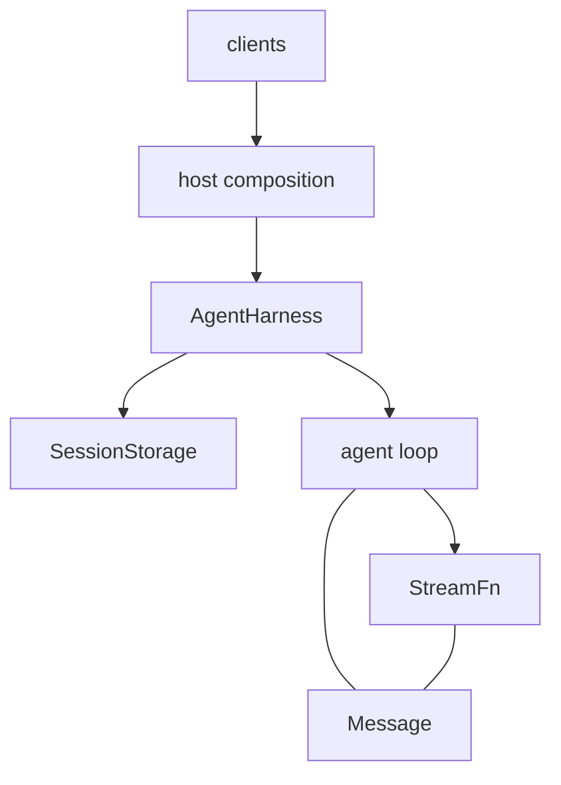

Uji has one conversation model and two runtime compositions over one loop.



## Packages

| Package             | Owns                                                                                      |
| ------------------- | ----------------------------------------------------------------------------------------- |
| `@uji-ai/schema`    | Neutral `Message`, `Model`, `Tool`, request-context, and content contracts                |
| `@uji-ai/ai`        | Provider adapters, `Models`, model catalogs, credentials, auth flows, and provider events |
| `@uji-ai/core`      | Agent loop, durable harness, session contracts, SQLite storage, plugins, and coding tools |
| `@uji-ai/plugin`    | Author API for plugins. The host and builtins live in core                                |
| `@uji-ai/telemetry` | `TelemetryContext` on `Context`. No exporter                                              |
| `@uji-ai/ui`        | Shared UI primitives; no agent runtime                                                    |
| `@uji-ai/tui`       | Terminal client                                                                           |
| Demo packages       | Product policy and composition roots                                                      |

`@uji-ai/protocol`, `@uji-ai/server`, and `@uji-ai/client` are reserved names with no directories.

<Cards>
  <DocCard
    icon="IconCodeBrackets"
    title="@uji-ai/schema"
    href="/docs/schema"
    description="Neutral Message, Model, Tool, and Skill contracts"
  />
  <DocCard
    icon="IconSparkle"
    title="@uji-ai/ai"
    href="/docs/ai"
    description="Providers, credentials, OAuth, and Models.streamSimple"
  />
  <DocCard
    icon="IconPackage"
    title="@uji-ai/core"
    href="/docs/core"
    description="Loop, harness, sessions, plugins, tools"
  />
  <DocCard
    icon="IconPlugin1"
    title="@uji-ai/plugin"
    href="/docs/plugin"
    description="definePlugin. The host lives in core"
  />
  <DocCard
    icon="IconChart1"
    title="@uji-ai/telemetry"
    href="/docs/telemetry"
    description="Context-carried spans. No exporter yet"
  />
  <DocCard
    icon="IconComponents"
    title="@uji-ai/ui"
    href="/docs/ui"
    description="Shared Base UI primitives"
  />
  <DocCard
    icon="IconConsole"
    title="@uji-ai/tui"
    href="/docs/tui"
    description="The uji terminal client"
  />
</Cards>

## Dependency direction

The loop is below the harness:

```text
harness → loop
loop ↛ harness
```

`agent-loop.ts` may depend on neutral AI contracts and local loop types. It must not import session storage,
the durable harness, clients, or product policy. The harness imports `runAgentLoopContinue` and supplies durable
queue, recovery, and event behavior around it.

Provider adapters live in `@uji-ai/ai`. Core depends on their neutral types and event stream, but the loop does not
select a provider or read credentials. A host registers providers in `Models` and injects
`Models.streamSimple` through `StreamFn`.

Tools are effects owned by the host process. The shipped tools currently use a local working directory, with
explicit seams for shell execution, read-only filesystem operations, and image processing. UI packages never
execute tools.

Plugins sit between the host and the harness. The harness owns no system prompt, tool list, or skill catalog;
every one of those is a plugin contribution, and the four built-ins (`system-prompt`, `context-files`,
`tools-fs`, `skills`) are plugins a host lists first. A user or project plugin replaces a built-in by id. The
host resolves the list (behind workspace trust) and activates it; plugin code runs in the host process and never
in a client. The [design record](/docs/design#plugins) holds the contract.

## One session model

Every conversation entry stores `Message`:

- `UserMessage` carries text or text/image content.
- `AssistantMessage` carries text, thinking, and tool calls plus usage and stop metadata.
- `ToolResultMessage` carries text/image output, error state, and optional tool details.

Provider adapters translate only at request and response boundaries. Sessions do not persist provider request
objects. Clients read the same neutral messages and ignore content they cannot render.

## Low-level composition

`runAgentLoop` is for callers that own their own state and event delivery. It takes prompts, an `AgentContext`, an
`AgentLoopConfig`, an event sink, a signal, and a `StreamFn`. It writes nothing.

`AgentHarness` uses the same loop over `SessionStorage`. It records run intent, message entries, tool intent,
usage, queues, abort requests, and terminal outcome. `SqliteSessionRepo` is the shipped backend.

## Host composition

The CLI and desktop each make explicit product choices:

1. Create `Models` with a credential store.
2. Register the providers that product supports.
3. Resolve auth and select a concrete `Model<Api>`.
4. Create a session and resolve the product's plugin list: built-ins, then user and project plugins once the
   workspace is trusted.
5. Inject a `StreamFn` closure and create `AgentHarness` with the plugin list and `env`.
6. Translate harness events into the client's presentation model, including the commands, settings, and
   resources plugins contribute.

Provider order, default model, default thinking level, session path, and UI rendering are host policy. They do
not belong in the loop or provider interface.

## Source layout

| Path                                         | Role                                                       |
| -------------------------------------------- | ---------------------------------------------------------- |
| `packages/schema/src/`                       | Neutral wire types                                         |
| `packages/ai/src/models.ts`                  | Provider registry, auth application, and stream delegation |
| `packages/core/src/agent-loop.ts`            | Turn, queue, tool-batch, and event sequencing              |
| `packages/core/src/harness/agent-harness.ts` | Durable loop composition                                   |
| `packages/core/src/harness/session/`         | Storage contract and SQLite implementation                 |
| `packages/core/src/plugins/`                 | PluginHost, registries, loaders, and builtin factories     |
| `packages/core/src/tools/`                   | Seven coding tools and their effect seams                  |
| `packages/plugin/src/`                       | `definePlugin` author API                                  |
| `packages/telemetry/src/`                    | `TelemetryContext` on `Context`                            |
| `packages/ui/src/`                           | Shared Base UI primitives                                  |
| `packages/tui/src/`                          | Terminal client                                            |

Source credits remain in ported files. Public package boundaries are determined by Uji's exports and the
dependency law above.
