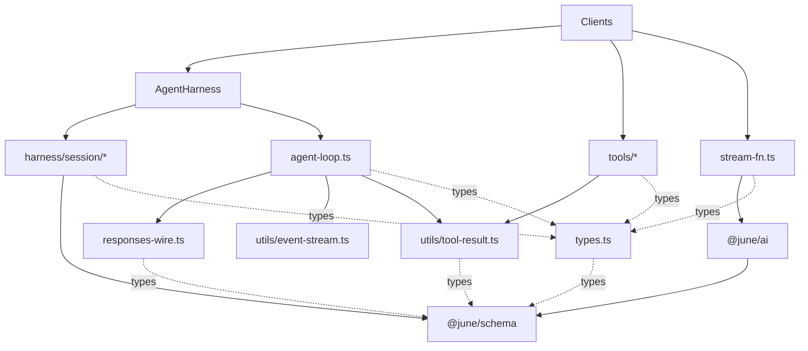

import { File, Files, Folder } from "fumadocs-ui/components/files";

June is a pnpm workspace of small TypeScript packages held together by one rule: dependencies point down, never up. The sharpest instance of that rule lives inside `@june/core`, where the agent loop and the durable harness are siblings over one primitive instead of a base class and a subclass.

## The layer map

Every arrow below points in the only direction an import may travel. `@june/schema` is the floor: it imports nothing in the workspace, and everything else eventually reaches it.



Solid arrows are runtime imports; dotted arrows are type-only imports. The four files around
`agent-loop.ts` are leaf support modules copied or adapted from Pi's own source layout. None can
reach the harness, provider bridge, tools, or Node built-ins.

The table says the same thing with the prohibitions attached. Read it top to bottom as the allowed direction of imports: nothing on a row may import anything below it.

| Layer             | Package / module                             | May import                                | Must not import                          |
| ----------------- | -------------------------------------------- | ----------------------------------------- | ---------------------------------------- |
| Wire types        | `@june/schema`                               | nothing in the workspace                  | every other June package                 |
| Provider adapters | `@june/ai`                                   | `@june/schema`                            | `@june/core`, `@june/ui`                 |
| Loop              | `agent-loop.ts` + its leaf support files     | local loop types/wire/utils; schema types | `harness/`, `tools/`, `@june/ai`, Node   |
| Tools             | `packages/core/src/tools/*`                  | loop types/result helper, Node, `diff`    | `harness/`, `@june/ai`                   |
| Provider bridge   | `packages/core/src/stream-fn.ts`             | `@june/ai`, loop types                    | `harness/`                               |
| Session storage   | `packages/core/src/harness/session/*`        | `@june/schema`, loop types, Node builtins | `agent-harness.ts`                       |
| Harness           | `packages/core/src/harness/agent-harness.ts` | loop, session storage, `result.ts`        | `@june/ui`, product shells               |
| UI primitives     | `@june/ui`                                   | `@base-ui/react`, itself                  | `@june/core`, `@june/ai`, `@june/schema` |
| Product shells    | `packages/demo/*`                            | any package's public entry                | any package's internal file paths        |

The rows below the loop are all compositions. `stream-fn.ts` is the only file in
`@june/core` that knows a provider exists; `harness/` is the only place that knows storage exists;
`tools/` is the only place that spawns a process. Filesystem access is split between the two:
`tools/` reads and writes the workspace, and `harness/session/sqlite.ts` creates the database
directory and file it opens with `node:sqlite`.

## The dependency law

`packages/core/src/agent-loop.ts` follows Pi's module cut instead of owning every supporting
declaration itself:

```ts
import {
  decodeToolArguments,
  getToolCalls,
  isAssistantMessage,
  toToolDefinition,
} from "./responses-wire.ts";
import type { AgentContext, AgentEvent, AgentLoopConfig, AgentMessage, StreamFn } from "./types.ts";
import { EventStream } from "./utils/event-stream.ts";
import { toolResultContent, toolResultText } from "./utils/tool-result.ts";
```

The dependency law applies to that small loop cluster. `types.ts` owns public contracts,
`responses-wire.ts` contains the Responses-item substitutions, `utils/event-stream.ts` is Pi's
generic stream, and `utils/tool-result.ts` owns June's part helpers. They are allowed dependencies;
the harness and provider bridge are not.

Conformance tests cover the behavior June shares with Pi: event ordering, argument preparation,
parallel completion order, truncated calls, continuation guards, and turn preparation. Source
credits identify the upstream reference without coupling maintenance to Pi's current file layout.

Delete `packages/core/src/harness/` and the loop cluster still typechecks. Only
`packages/core/src/index.ts`, which re-exports the harness, would need editing. The loop entry and
its relative leaf imports compile without the harness:

```bash
cd packages/core
./node_modules/.bin/tsc --ignoreConfig --noEmit \
  --allowImportingTsExtensions --erasableSyntaxOnly --module nodenext \
  --strict --target es2025 --types node --verbatimModuleSyntax src/agent-loop.ts
```

<Callout type="info" title="The reverse arrow is legal">
  `packages/core/src/harness/session/types.ts` imports `type {TurnUsage}` from `../../types.ts`, and
  `agent-harness.ts` imports `runAgentLoopContinue` from the loop. That is harness depending on the
  loop cluster, which is the permitted direction. An import pointing back into `harness/` breaks the
  law.
</Callout>

Everything the loop needs that it cannot express in `@june/schema` types is a parameter, not a dependency:

| `runAgentLoop` parameter | Type                       | Supplied by                                         |
| ------------------------ | -------------------------- | --------------------------------------------------- |
| `prompts`                | `ResponseItem[]`           | the caller                                          |
| `context`                | `AgentContext`             | the caller (system prompt, prior messages, tools)   |
| `config`                 | `AgentLoopConfig`          | the caller (model, hooks, queue drains)             |
| `emit`                   | `AgentEventSink`           | the caller                                          |
| `signal`                 | `AbortSignal \| undefined` | the caller                                          |
| `streamFn`               | `StreamFn`                 | `createProviderStreamFn`, or any function you write |

## Composition, not inheritance

The light loop and the durable harness are two entry points over the same primitive. Neither extends the other.

Driving the loop directly needs no session, no database, and no provider. A `StreamFn` is a plain async function, so a fake one is a full substitute:

```ts
import { runAgentLoop, toolResultContent } from "@june/core";
import type { AgentTool, StreamFn } from "@june/core";
import type { ResponseItem } from "@june/schema";

const echo: AgentTool<{ text: string }> = {
  name: "echo",
  label: "Echo",
  description: "Return the text it is given",
  parameters: {
    type: "object",
    properties: { text: { type: "string" } },
    required: ["text"],
  },
  execute: async (_toolCallId, params) => ({
    content: toolResultContent(params.text),
    details: undefined,
  }),
};

const streamFn: StreamFn = async () => ({
  items: [{ type: "message", role: "assistant", content: [{ type: "output_text", text: "hi" }] }],
  stopReason: "stop",
});

const prompts: ResponseItem[] = [{ role: "user", content: "say hi" }];

const newMessages = await runAgentLoop(
  prompts,
  { systemPrompt: "You are terse.", messages: [], tools: [echo as AgentTool] },
  { model: "gpt-5.6-luna", toolExecution: "parallel" },
  (event) => {
    if (event.type === "message_end") console.log(event.message);
  },
  undefined,
  streamFn,
);
console.log(newMessages.length);
```

The harness composes the same loop by passing storage-aware callbacks into `AgentLoopConfig` and an event sink that writes each `message_end` to the session. It calls `runAgentLoopContinue`; it does not subclass anything:

```ts
import {
  AgentHarness,
  createAllTools,
  createProviderStreamFn,
  SqliteSessionRepo,
} from "@june/core";
import type { HarnessTool } from "@june/core";
import { defaultProviders, FileCredentialStore } from "@june/ai";

const repo = new SqliteSessionRepo(".june/sessions.db");
const session = await repo.create();
const provider = defaultProviders()[0];
if (provider === undefined) throw new Error("no providers");

const tools: HarnessTool[] = createAllTools(process.cwd()).map((tool) => ({
  ...tool,
  replay: tool.name === "read" ? "safe" : "never",
}));

const { harness, suspended } = await AgentHarness.create({
  session,
  streamFn: createProviderStreamFn({ provider, auth: { store: new FileCredentialStore() } }),
  systemPrompt: "You are terse.",
  tools,
});

console.log(suspended.length);
const result = await harness.prompt("list the files here");
if (result.ok) console.log(result.value.kind);
else console.log(result.error._tag);
await harness.close();
```

Why this shape rather than an `AgentBase` the harness extends: durability is one policy over the loop, not the only one. A second policy (an in-memory run, a test double, a server-side runner) would attach at the same seam without touching loop code, and a bug in the durable path cannot reach a caller that never asked for it. See [the agent loop](./core/agent-loop.mdx), and [the harness](./core/harness.mdx) for the two surfaces in detail.

## The workspace today

`pnpm-workspace.yaml` declares two globs, `packages/*` and `packages/demo/*`. Everything below exists on disk now, and the list is every package those globs match.

| Package               | Directory                | Workspace dependencies                                                  |
| --------------------- | ------------------------ | ----------------------------------------------------------------------- |
| `@june/schema`        | `packages/schema`        | none                                                                    |
| `@june/ai`            | `packages/ai`            | `@june/schema`                                                          |
| `@june/core`          | `packages/core`          | `@june/schema`, `@june/ai`                                              |
| `@june/ui`            | `packages/ui`            | none                                                                    |
| `@june/demo`          | `packages/demo/cli`      | `@june/ai`, `@june/core`, `@june/schema`                                |
| `@june/demo-grok-bot` | `packages/demo/grok-bot` | `@june/ai`, `@june/core`, `@june/ui`                                    |
| `@june/demo-website`  | `packages/demo/website`  | `@june/ui`                                                              |
| `demo`                | `packages/demo`          | none: a name-only package, the demo folder itself matching `packages/*` |
| `docs`                | `packages/docs`          | none                                                                    |

`@june/ui` is Base UI primitives styled with StyleX. It carries no dependency on `@june/core` or `@june/ai`, and it must not acquire one: a product shell wires the two together, the component library does not.

<Files>
  <Folder name="packages/core/src" defaultOpen>
    <File name="index.ts" />
    <File name="agent-loop.ts" />
    <File name="types.ts" />
    <File name="responses-wire.ts" />
    <File name="stream-fn.ts" />
    <Folder name="utils">
      <File name="event-stream.ts" />
      <File name="tool-result.ts" />
    </Folder>
    <Folder name="harness" defaultOpen>
      <File name="agent-harness.ts" />
      <File name="result.ts" />
      <Folder name="session">
        <File name="types.ts" />
        <File name="sqlite.ts" />
        <File name="sql.ts" />
      </Folder>
    </Folder>
    <Folder name="tools">
      <File name="index.ts" />
      <File name="bash.ts" />
      <File name="edit.ts" />
      <File name="edit-diff.ts" />
      <File name="find.ts" />
      <File name="grep.ts" />
      <File name="ls.ts" />
      <File name="read.ts" />
      <File name="write.ts" />
      <Folder name="support">
        <File name="file-mutation-queue.ts" />
        <File name="image.ts" />
        <File name="output-accumulator.ts" />
        <File name="path-utils.ts" />
        <File name="shell.ts" />
        <File name="tool-result-images.ts" />
        <File name="truncate.ts" />
      </Folder>
    </Folder>
  </Folder>
</Files>

## Reserved names, not built

These package names are locked by the blueprint's 2026-08-12 decision and follow OpenCode's map, so that a future split does not rename anything. None of them exist yet.

| Reserved package | Intended role                                              | Status              |
| ---------------- | ---------------------------------------------------------- | ------------------- |
| `@june/protocol` | Host API surface (session, workspace, permissions, events) | Reserved, not built |
| `@june/server`   | Local HTTP host binding                                    | Reserved, not built |
| `@june/client`   | Typed client for UIs                                       | Reserved, not built |
| `@june/util`     | Shared helpers                                             | Reserved, not built |
| `@june/plugin`   | Plugin surface                                             | Reserved, not built |

Not built yet: there is no wire protocol, no HTTP server, and no multi-client transport in this repo. The
Electron main process imports `@june/core`; its sandboxed renderer reaches a product-specific host over IPC.
That `JuneHost` is evidence for the boundary, not the shared implementation. The missing contract and the
demo's current limits are inventoried in [the host and client contract](./host-sdk.mdx).

These names are banned outright rather than reserved: `@june/parts`, `@june/agent`, `@june/store`, `@june/host-local`. Store, log, and host swaps are adapters composed into `core` (the way `SqliteSessionRepo` implements `SessionRepo`), not top-level packages.

## Where new code goes

The litmus: if it is pixels or copy for a human deciding something, it is UI. If it is durable state, tool execution, wake conditions, or what the model can call, it is core.

| What you are adding                                    | Where it goes                                                                           |
| ------------------------------------------------------ | --------------------------------------------------------------------------------------- |
| A field on the Responses wire                          | `@june/schema`                                                                          |
| A provider, an auth flow, or a credential store        | `@june/ai`                                                                              |
| A tool the model can call                              | `packages/core/src/tools/`, then register it in `tools/index.ts`                        |
| Turn control, tool-batch policy, queue drain semantics | `packages/core/src/agent-loop.ts` (only if it is expressible with `@june/schema` types) |
| A durable entry type, record type, or storage backend  | `packages/core/src/harness/session/`                                                    |
| Run bracketing, crash replay, abort, resume            | `packages/core/src/harness/agent-harness.ts`                                            |
| Whether a tool is allowed to run at all (the policy)   | `@june/core`                                                                            |
| The approval card that asks the human (the pixels)     | `@june/ui` or a product shell                                                           |
| Chat bubbles, diff viewers, file trees, scrollers      | `@june/ui` or a product shell                                                           |
| An HTTP route or a wire event                          | Nowhere yet: `@june/protocol` and `@june/server` are unbuilt                            |

Two follow-on rules make the table decidable:

1. If the code needs `SessionStorage`, it belongs under `harness/`, never in `agent-loop.ts`.
2. If the code needs a provider or credentials, it belongs in `@june/ai` or in `stream-fn.ts`, never in `agent-loop.ts` and never in a tool.

## No build step

No package ships compiled output. `@june/schema`, `@june/ai`, and `@june/core` set `"exports": { ".": "./src/index.ts" }`; `@june/ui` maps its subpaths (`./components/*`, `./lib/*`, `./style`, the CSS files) straight at source as well. Node 26 (pinned in `mise.toml`) strips types at load, so `packages/core/src/index.ts` is both the source and the package entry. `tsconfig.base.json` enforces what that requires: `allowImportingTsExtensions`, `erasableSyntaxOnly`, `verbatimModuleSyntax`, and `noEmit`.

Two consequences you will hit:

- Relative imports inside a package carry the `.ts` extension (`from "./agent-loop.ts"`), because that is the file Node will actually open.
- `tsc` is a checker, not a compiler. `pnpm typecheck` in a package runs `tsc --noEmit`; nothing produces `dist/`.

`@june/core` also relies on `node:sqlite`, so a consumer needs a Node with that module available. Every June package is `private: true` today and none is published to npm.

## No Effect

June is plain TypeScript; Effect was evaluated and rejected. Three structural consequences show up in the layout above: the harness carries `Result` plus `TaggedError` at its own boundary instead of a typed error channel, adapters (`streamFn`, `session`, `tools`) are explicit parameters instead of layers, and `AbortSignal` is threaded through the loop, the tools, and the provider client instead of structured concurrency. The reasoning, the escape hatch, and the honest account of what that costs are on [Principles](/docs/principles).

<Cards>
  <Card
    title="The agent loop"
    href="/docs/core/agent-loop"
    description="The standalone primitive: turns, tool batches, events"
  />
  <Card
    title="The harness"
    href="/docs/core/harness"
    description="Durable runs composed over the loop"
  />
  <Card
    title="Session storage"
    href="/docs/core/session-storage"
    description="Entries, records, and the SQLite backend"
  />
  <Card
    title="Tools"
    href="/docs/core/tools"
    description="The seven built-in tools and their factories"
  />
</Cards>
