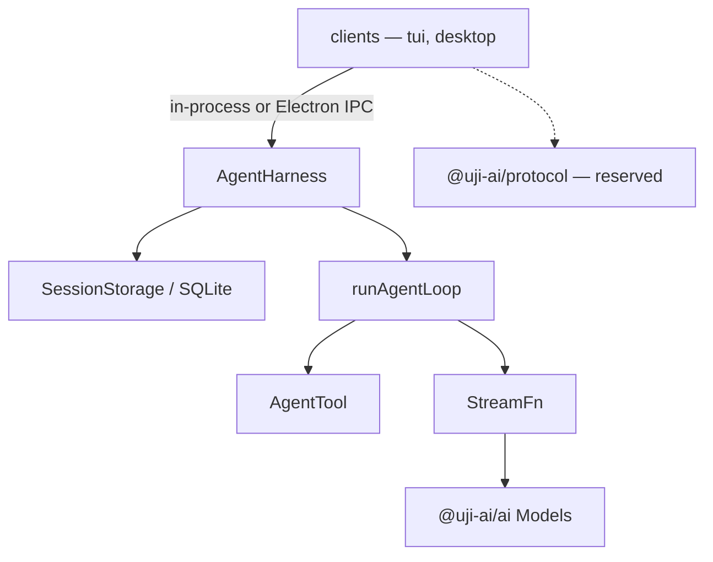

Uji is an independent, handwritten core for building cross-platform agentic UI. It is not a chat product and not only an agent loop. The position it takes is that harnesses and agent loops are already well understood and the UI layer is the unsolved part, so the core stays small and durable and many clients attach to it, rather than a UI framework with a loop welded inside it. The loop, harness, session storage, tools, and provider blocks are written in this repo; no other project's harness is imported or wrapped as the implementation.

Two clients attach today, both in-process: the terminal CLI and the Electron desktop chat. A browser client has nothing to attach to yet. That is what the unbuilt `@uji-ai/protocol`, `@uji-ai/server`, and `@uji-ai/client` rows below are for.

## The shape

A client never runs the loop. It talks to a harness, the harness drives the loop, the loop talks to a provider through an injected `StreamFn`, and tools are bound to whichever process owns the filesystem and shell.



The tool host is a placement, not a fixed location. Today every tool in `@uji-ai/core` runs against a `cwd` string in the harness process. Nothing about `AgentTool` requires that process to be local, but no remote tool host exists yet.

## The smallest real composition

This is the shape `packages/tui/src/run.ts` uses, trimmed. Node 26 runs the TypeScript sources directly, so there is no build step.

```ts title="packages/tui/src/run.ts"
import process from "node:process";
import { createModels, FileCredentialStore, openaiCodexProvider } from "@uji-ai/ai";
import { AgentHarness, createAllTools, SqliteSessionRepo } from "@uji-ai/core";

const repo = new SqliteSessionRepo(".uji/sessions.db");
const session = await repo.create();
const models = createModels({ credentials: new FileCredentialStore() });
const provider = openaiCodexProvider();
models.setProvider(provider);
const model = models.getModel(provider.id, "gpt-5.6-luna");
if (model === undefined) throw new Error("model unavailable");

const { harness, suspended } = await AgentHarness.create({
  session,
  streamFn: (requestedModel, context, options) =>
    models.streamSimple(requestedModel, context, options),
  systemPrompt: "You are a coding agent. Be concise.",
  tools: createAllTools(process.cwd()),
  model,
});

harness.subscribe((event) => {
  if (event.type === "message_update" && event.assistantMessageEvent.type === "text_delta") {
    process.stdout.write(event.assistantMessageEvent.delta);
  }
});

// create() reports runs a crash left open on this session; it never resumes on its own.
// A session from repo.create() is new and has none: reopen one with repo.open(id) to hit this.
if (suspended.length > 0) await harness.resume();

const result = await harness.prompt("list the TypeScript files here");
if (result.ok && result.value.kind === "failed") {
  console.error(result.value.error.message);
}
await repo.close();
```

<Callout type="warn" title="Result.ok does not mean the run succeeded">
  `prompt()` returns `Result.err` only for precondition failures (`HeadBusy`, `Closed`). A provider
  failure or a thrown tool error arrives inside `Result.ok` as `{ kind: "failed", error }`. Session
  storage failures are different again: they throw `SessionError`. [The harness
  page](/docs/core/harness#lifecycle-api) states the three error channels in full.
</Callout>

Requirements as of today: Node 26 with `node:sqlite` available, `--experimental-ffi` for the TUI, and `rg` (ripgrep) on `PATH` for the `grep` and `find` tools.

## What exists today

The library and application packages remain private. `uji-ai` is the public executable distribution; its `0.0.1` placeholder reserves the package and `uji` bin while the runnable distribution is assembled. "Shipped" below means the source exists in this workspace and runs. `@uji-ai/schema`, `@uji-ai/ai`, and `@uji-ai/core` each declare a single `exports` entry pointing straight at `./src/index.ts`. `@uji-ai/tui` is the terminal client package. It runs from source and is not a published bin. [Roadmap](/docs/roadmap) carries the same table with the gap analysis attached.

| Package                        | Status                | One line                                                                                                        |
| ------------------------------ | --------------------- | --------------------------------------------------------------------------------------------------------------- |
| `@uji-ai/schema`               | Shipped               | Neutral `Message`, `Model`, `Tool`, request-context, and content contracts shared across the runtime            |
| `@uji-ai/ai`                   | Shipped               | `Models`, provider adapters, model catalogs, credentials, auth flows, and neutral assistant event streams       |
| `@uji-ai/core`                 | Shipped               | The standalone agent loop, `AgentHarness`, SQLite sessions, plugins, skills, compaction, and seven coding tools |
| `@uji-ai/plugin`               | Shipped               | Author API: `definePlugin` and the types a plugin file imports. The host lives in core                          |
| `@uji-ai/telemetry`            | Shipped               | `TelemetryContext` on `Context`. `NOOP_TELEMETRY_CONTEXT` records nothing; no exporter yet                      |
| `@uji-ai/ui`                   | Shipped               | Shared Base UI primitives. No agent runtime                                                                     |
| `@uji-ai/tui` (`packages/tui`) | Shipped               | The `uji` CLI: full-screen TUI, `-p` print mode, login funnel                                                   |
| `uji-ai` (`packages/cli`)      | Placeholder published | Public executable distribution that reserves the `uji` bin                                                      |
| `@uji-ai/protocol`             | Reserved, not built   | The wire clients would bind to. No directory exists                                                             |
| `@uji-ai/server`               | Reserved, not built   | The HTTP+SSE host. No directory exists                                                                          |
| `@uji-ai/client`               | Reserved, not built   | The typed TS client. No directory exists                                                                        |

Demos and supporting packages:

| Path                    | Package                | One line                                                                                                     |
| ----------------------- | ---------------------- | ------------------------------------------------------------------------------------------------------------ |
| `packages/demo/desktop` | `@uji-ai/demo-desktop` | Electron desktop chat; the main process hosts the harness, the sandboxed renderer sees a typed preload API   |
| `packages/demo/website` | `@uji-ai/demo-website` | TanStack Start marketing site; it does not run a harness                                                     |
| `packages/ui`           | `@uji-ai/ui`           | Shared Base UI primitives styled with StyleX, composed by product shells instead of growing one-off controls |
| `packages/docs`         | `docs`                 | This site                                                                                                    |

## What is deliberately not here

Two different lists. The first is out of scope for the core on purpose; the second is in scope and unwritten.

### Out of scope by design

The UI owns these. A core that ships them decides product questions on the client's behalf.

- **Permission and approval chrome.** No cards, no modals, no disclosure UX. The core's share of that concern would be policy and pause, never the pixels.
- **Chat scroller, bubbles, and chat hooks.** That is shadcn and AI SDK UI territory.
- **IDE shell chrome.** File tree layout, pane arrangement, pixel-level mimicry of any editor.
- **Progressive disclosure presentation.** How skills and tools appear or hide in a shell.
- **Surface tone and styling.** Slack voice versus in-app chat voice.
- **A baked-in MCP marketplace.** Connectors may become tool sources later; one vendor's ontology does not become the core's.
- **An ambient workspace.** Sessions never require a folder. A product that needs files asks for one explicitly.

### In scope, not built yet

Named so you do not assume they work.

- Protocol, server, and client packages. Clients reach the harness by direct call or Electron IPC, never over a wire.
- The host and SDK layer between the core and a product. `sdk.provider` and `sdk.session` appear only inside `TODO` comments, so each product assembles Core itself. [The host and SDK layer](./host-sdk.mdx) is the inventory.
- Multiple heads. `AgentHarness` hardcodes the single head `"main"`.
- Branch navigation and forks. Compaction exists; sessions still have one lane.
- Retry policy. There is no attempt cap and no backoff.
- A telemetry exporter. `@uji-ai/telemetry` is a no-op parent on `Context`.
- Tool approval policy. `beforeToolCall` can block a call; nothing in the repo uses it for approval.
- Session backends other than SQLite. There is no in-memory backend.

## Where to go next

<Cards>
  <DocCard
    icon="IconRocket"
    title="Quickstart"
    href="/docs/quickstart"
    description="Install the workspace, log in to a provider, and get a streaming run"
  />
  <DocCard
    icon="IconLayersThree"
    title="Architecture"
    href="/docs/architecture"
    description="The layering rule: harness may import the loop, the loop never imports the harness"
  />
  <DocCard
    icon="IconPackage"
    title="@uji-ai/core"
    href="/docs/core"
    description="Agent loop, harness, session storage, tools, and the provider StreamFn"
  />
  <DocCard
    icon="IconPlan"
    title="Roadmap"
    href="/docs/roadmap"
    description="What the not-built-yet rows above turn into, and in what order"
  />
</Cards>

## Packages

<Cards>
  <DocCard
    icon="IconCodeBrackets"
    title="@uji-ai/schema"
    href="/docs/schema"
    description="Neutral Message, Model, Tool, and Skill contracts"
  />
  <DocCard
    icon="IconSparkle"
    title="@uji-ai/ai"
    href="/docs/ai"
    description="Providers, credentials, OAuth, and Models.streamSimple"
  />
  <DocCard
    icon="IconPlugin1"
    title="@uji-ai/plugin"
    href="/docs/plugin"
    description="definePlugin. The host lives in core"
  />
  <DocCard
    icon="IconChart1"
    title="@uji-ai/telemetry"
    href="/docs/telemetry"
    description="Context-carried spans. No exporter yet"
  />
  <DocCard
    icon="IconComponents"
    title="@uji-ai/ui"
    href="/docs/ui"
    description="Shared Base UI primitives"
  />
  <DocCard
    icon="IconConsole"
    title="@uji-ai/tui"
    href="/docs/tui"
    description="The uji terminal client"
  />
</Cards>

<Callout type="info" title="Where the design lives">
  The [design record](/docs/design) states the chosen session model, the SDK contracts, the
  invariants, and the build order, with the reasoning attached. Package pages record only what the
  source supports. When a page and the source disagree, the source wins and the page is wrong.
</Callout>
